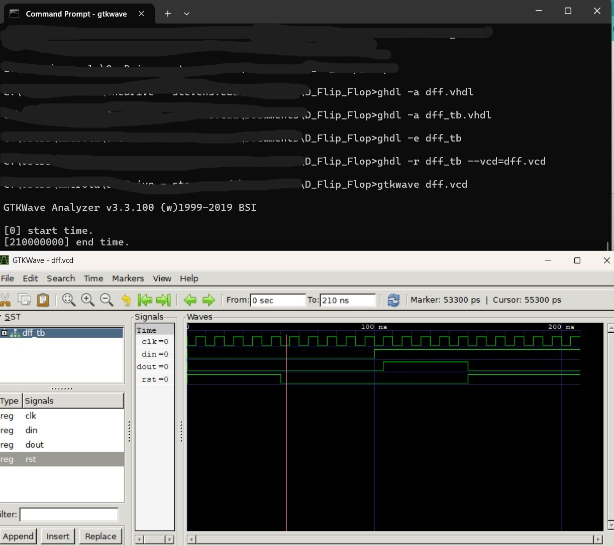

# Lab 1 - GHDL and GTKWave
#### In this lab, I followed the instructions to download and configure both GHDL and GTKWave. The files were extracted and placed into an eda folder on my C: drive, and the correct paths were added to the system enviornment variables. After confirming the setup worked from the command line, I tested simulations using both tools with example VHDL files.

## Half Adder Example
#### The first design I simulated was a Half Adder, which consisted of two VHDL files:
#### - ha.vhdl for the main circuit
#### - ha_tb.vhdl as the testbench
#### The Half Adder takes two inputs (a and b) and produces two outputs:
#### - sum (a XOR b)
#### - carry (a AND b)
#### Using GHDL commands, I analyzed, compiled, and ran the simulation. It generated a .vcd waveform file which I opened usng GTKWave. The testbench cycled through all possible input combinations and the output waveform confirmed that the circuit worked as expected.

#### At first, all signals start undefined. As the inputs toggle, the outputs follow proper logic:
#### - When a=0 and b=0, both sum and carry are 0.
#### - When only one input is 1, sum becomes 1 and carry stays 0.
#### - When both are 1, sum goes to 0 and carry becomes 1.

## D Flip-Flop Example
#### The second circuit was a simple D Flip-Flop. It uses the following VHDL files:
#### - dff.vhdl for the component
#### - dff_tb.vhdl to test it
#### This circuit stores a value from the din input on each rising clock (clk) edge. It also has a rst (reset) signal which forces the output (dout) to 0 when active. Using the same GHDL commands, I simulated the flip-flop and generated a dff.vcd file to view in GTKWave.

#### The waveform shows that when reset is active, the output stays low. Once reset is turned off and a rising clock edge happens, dout copies the value of din. Later, when reset is re-enabled, the output is cleared again, showing correct flip-flop behavior.

#### Both desings, the Half Adder and the D Flip Flop, were successfully simulated. The waveforms generated in GTKWave matched the expected logic and confirmed that the VHDL implemenetations were working. This lab was a good hands-on introduction to using GHDL for imulation and GTKWave for waveform debugging.
