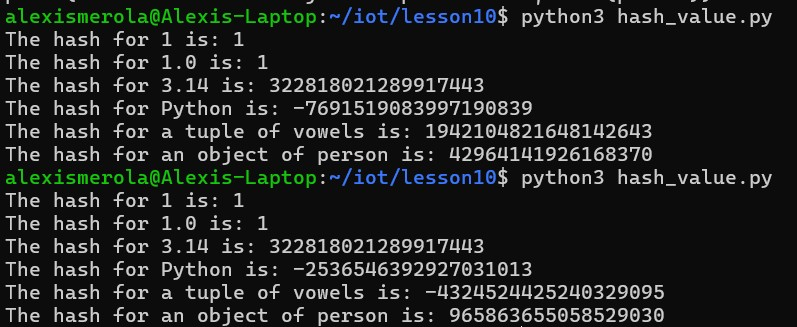
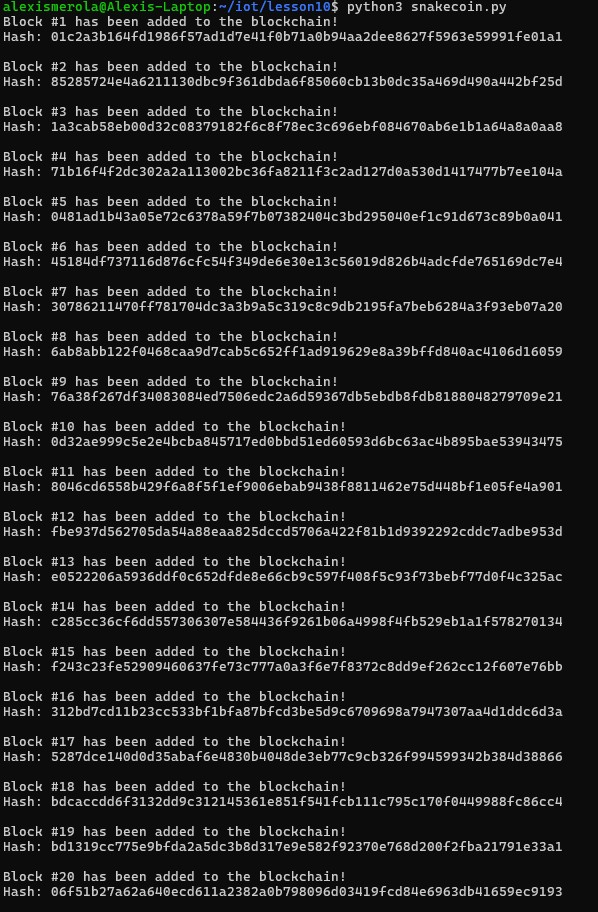
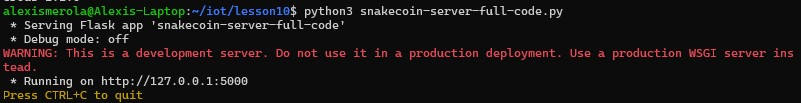
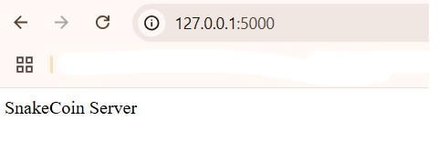
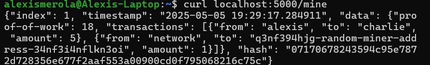
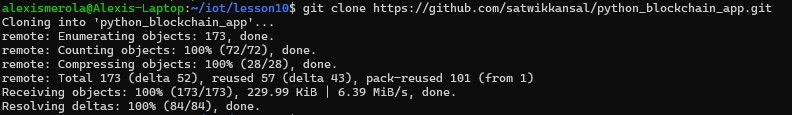
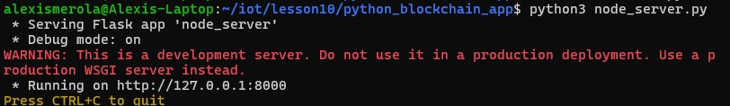
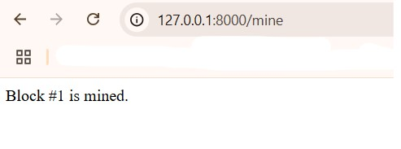
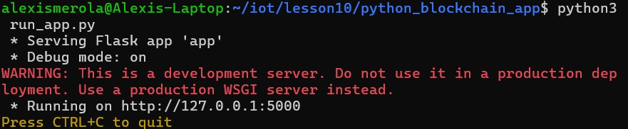
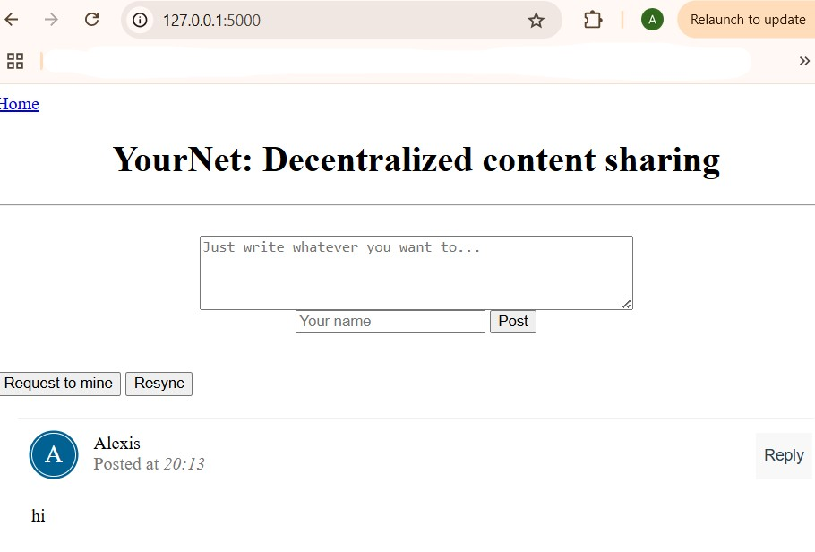

# Lab 10 - Blockchain
#### This lab introduced core blockchain concepts through two Python-based projects: SnakeCoin and a more advanced blockchain web app. The first part demonstrated how hashing functions work and how blocks are linked through hashes to form a secure blockchain. In the second part, a real-time blockchain application was explored, showcasing how transactions are created, mined, and synchronized between front-end and back-end systems. This hands-on experience helped reinforce how decentralized systems handle data integrity, proof of work, and network communication.
---
### Run hash_value.py twice
#### This part demonstrates how hash functions behave in Python. Running hash_value.py twice shows consistent hashes for simple data types but differing values for complex or randomized inputs, revealing how Python handles hash generation.

---
### Run snakecoin.py
#### This script simulates a minimal blockchain. It builds and prints a chain of 20 blocks where each block depends on the hash of the previous one — showing how blockchain ensures data integrity through linking.

---
### Run snakecoin-server-full-code.py on Terminal 1 and mine a new block on Terminal 2
#### Terminal 1:
#### - A Flask server is started using snakecoin-server-full-code.py. It hosts blockchain-related endpoints like /mine.

#### Terminal 2:
#### - Using curl, a transaction is submitted and then mined into a block using the /mine endpoint. This confirms successful interaction with the blockchain node.

---
### Clone Python blockchain app and uncomment the last line of node_server.py
#### The more advanced blockchain project is cloned from GitHub. Inside node_server.py, the last line that sets the server port is uncommented to activate the Flask backend at port 8000.

---
### Run node_server.py on Terminal 1 and run_app.py on Terminal 2
#### Terminal 1:
#### - The blockchain backend is launched with node_server.py, exposing endpoints used by the frontend.

#### Terminal 2:
#### - The web interface is started using run_app.py. It provides a simple UI to post messages, mine them into blocks, and resync the blockchain to display updated content.

---
#### By completing this lab, I gained a practical understanding of how blockchain technology works under the hood. I observed the behavior of SHA-256 hashing, implemented a simple blockchain in Python, and interacted with a full-stack blockchain application through a browser-based interface. From submitting transactions to mining new blocks and syncing data across terminals, this lab highlighted the essential mechanics of blockchains in a real-world setting.
