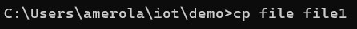
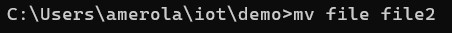
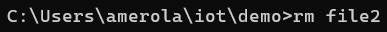
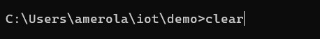
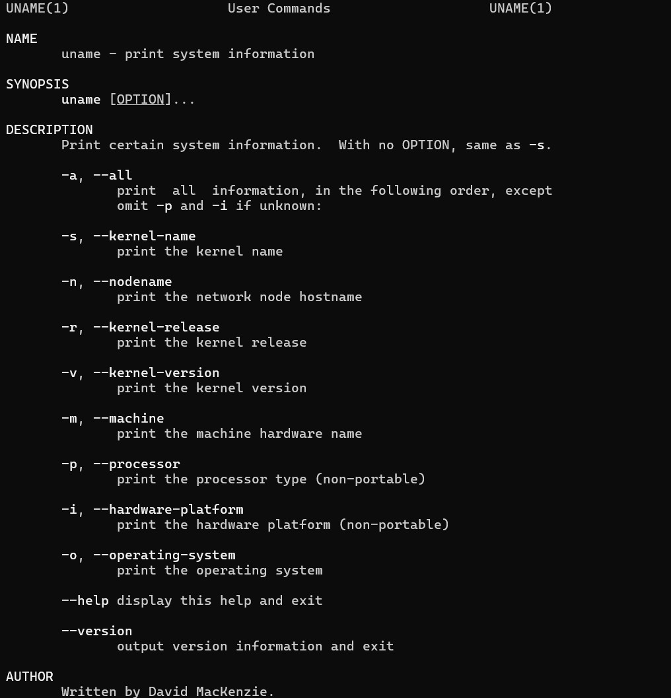
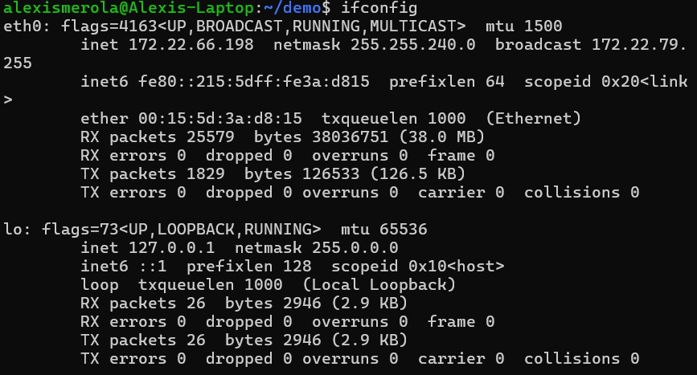
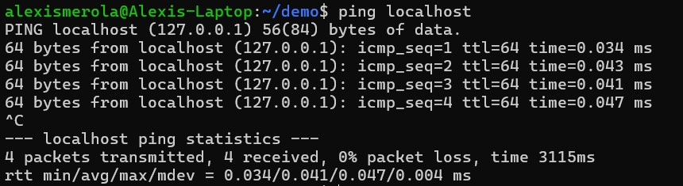
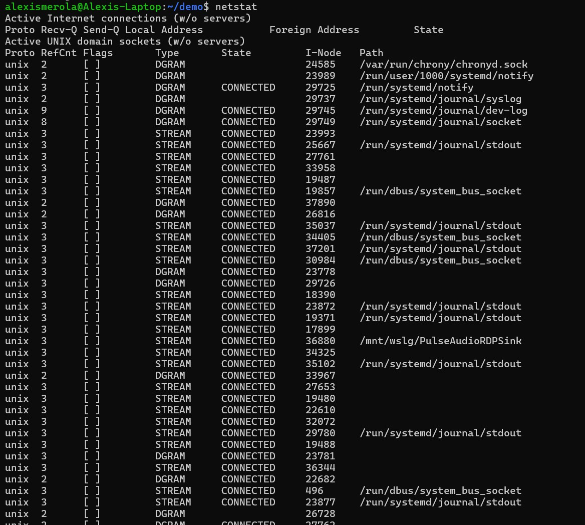

# Lab 2 - Command Line
#### 

### hostname
#### Shows the name of your computer or device on the network.

### env
#### Displays environment variables set in the shell session.

### ps
#### Lists current running processes for the terminal.

### pwd
#### 	Prints the current working directory (i.e., where you are).

### git clone
#### Clones the IoT course GitHub repo to your computer.

### cd iot
#### Changes directory into the newly cloned iot folder.

### ls
#### Lists files and folders in the current directory.

### cd
#### Changes directory (alone, it goes back to the home directory).

### df
#### 	Displays disk space usage for file systems.

### mkdir demo
#### Makes a new folder named demo.

### cd demo
#### Changes directory into the demo folder.

### nano file
#### Opens a text editor (nano) to create or edit a file called file.

### cat file
#### Prints the contents of a file to the terminal.

### cp file file1
#### Copies file to a new file named file1.

### mv file file2
#### Moves (or renames) file to file2.

### rm file2
#### Permanently deletes file2.

### clear
#### 	Clears the terminal screen.

### man uname
#### Opens the manual (help page) for the uname command.

### uname -a
#### 	Displays system information including OS name, version, and hardware.

### ifconfig
#### Shows network configuration and IP addresses.

### ping localhost
#### Sends ping requests to your own device (loopback test).

### netstat
#### Displays network connections, listening ports, and routing tables.

