# Lab 2 - Command Line
#### 

### hostname
#### 

### env
#### 
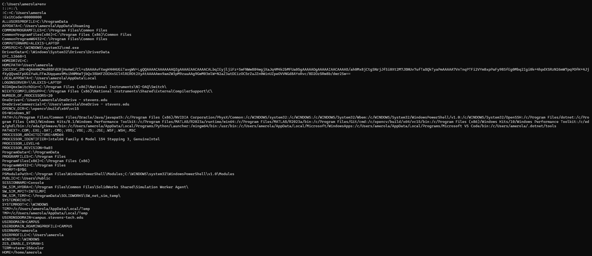

### ps
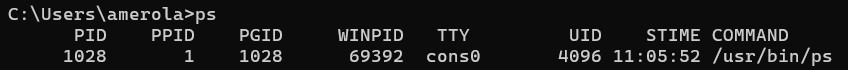

### pwd
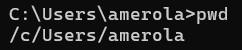

### git clone
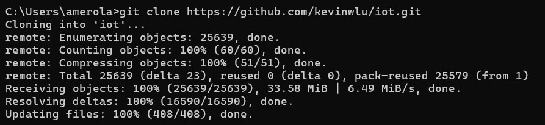

### cd iot
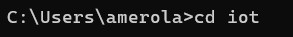

### ls
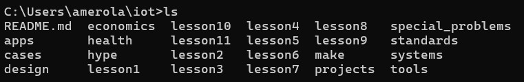

### cd
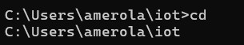

### df
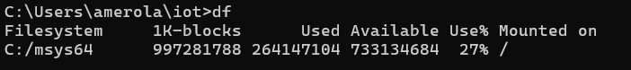

### mkdir demo
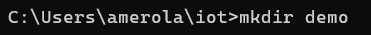

### cd demo
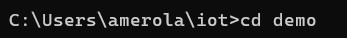

### nano file
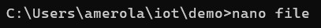

### cat file
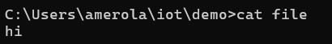
