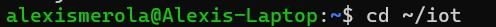

# Lab 3 - Python
#### 

### cd ~/iot
#### 

### cd *3
#### 

### python3 julian.py
#### 

### python3 date_example.py
#### 

### python3 datetime_example.py
#### 

### python3 time_example.py
#### 

### python3 sun.py "New York"
#### 

### python3 moon.py
#### 

### python3 coordinates.py "Samuel C. Williams Library"
#### 

### python3 address.py "40.74480675, -74.02532861159351"
#### 

### python3 cpu.py
#### 

### python3 battery.py
#### 

### python3 documentstats.py document.txt
#### 

