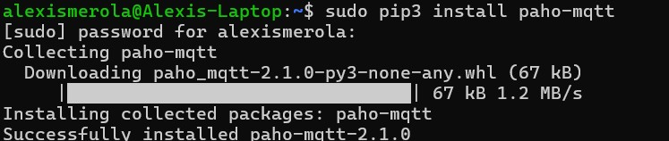
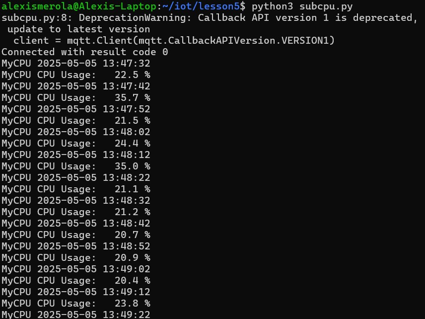
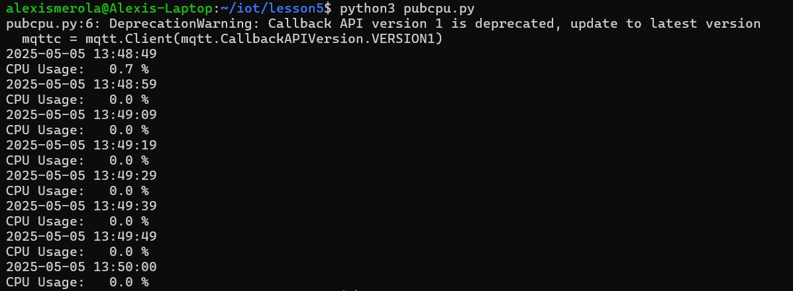

# Lab 5 - Paho-MQTT
#### This lab focused on setting up MQTT-based communication in Python using the Paho-MQTT library. MQTT, short for Message Queuing Telemetry Transport, is a lightweight protocol designed for efficient message exchange — a common need in Internet of Things (IoT) applications. In this exercise, I used two Python scripts: one to act as a publisher that sends real-time CPU usage data, and another to function as a subscriber that receives and displays that data. By successfully simulating this publish/subscribe model, the lab highlighted how MQTT can facilitate reliable, low-overhead messaging between devices or services in a distributed system.

### Install Paho-MQTT
#### The lab began by installing the paho-mqtt library using Python’s pip3 package manager. This library allows Python scripts to send and receive messages using the MQTT protocol. The installation completed successfully without any errors.

### Update the repository with git pull and change directory to Lesson 5
#### The repository containing the necessary Python scripts was cloned using the git clone command. This provided access to all lesson folders, including the files for Lab 5. After cloning, I navigated to the Lesson 5 directory to begin running the MQTT scripts.

### python3 subcpu.py
#### In the first terminal, I ran the subcpu.py script, which connects to the MQTT broker and listens for incoming CPU data published to a specific topic. This subscriber remains active and continuously waits for new messages.

### python3 pubcup.py
#### In a second terminal, the pubcpu.py script was executed. This script gathers real-time CPU usage from the system and publishes it to the MQTT topic. The data was received by the subscriber terminal in real time, confirming successful communication.

