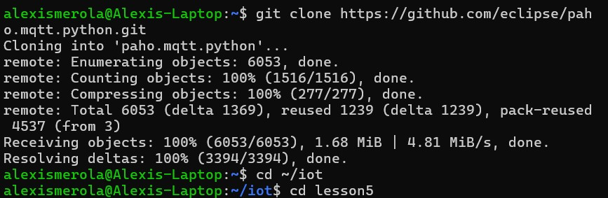

# Lab 5 - Paho-MQTT
#### In this lab, I explored how to implement MQTT-based messaging in Python using the Paho-MQTT library. MQTT (Message Queuing Telemetry Transport) is a lightweight, publish-subscribe communication protocol commonly used in IoT systems for sending data between devices. By using simple Python scripts, I set up both a publisher to transmit CPU usage data and a subscriber to receive and display that information in real time. This lab demonstrated how MQTT enables efficient and responsive communication between processes, simulating device-to-device messaging in a real-world IoT environment.

### Install Paho-MQTT
#### The lab began by installing the paho-mqtt library using Python’s pip3 package manager. This library allows Python scripts to send and receive messages using the MQTT protocol. The installation completed successfully without any errors.

### Update the repository with git pull and change directory to Lesson 5
#### After the library was installed, the repository was updated using git pull to ensure the latest versions of the lab files were available. Once updated, I navigated into the Lesson 5 directory where the MQTT-related scripts are located.

### python3 subcpu.py
#### In the first terminal, I ran the subcpu.py script, which connects to the MQTT broker and listens for incoming CPU data published to a specific topic. This subscriber remains active and continuously waits for new messages.

### python3 pubcup.py
#### In a second terminal, the pubcpu.py script was executed. This script gathers real-time CPU usage from the system and publishes it to the MQTT topic. The data was received by the subscriber terminal in real time, confirming successful communication.

