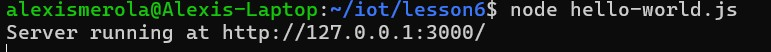
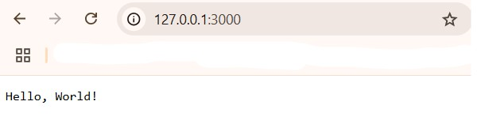
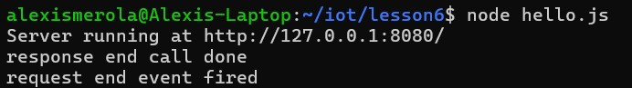
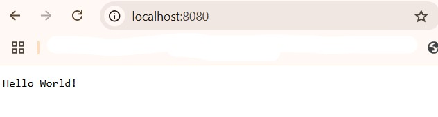
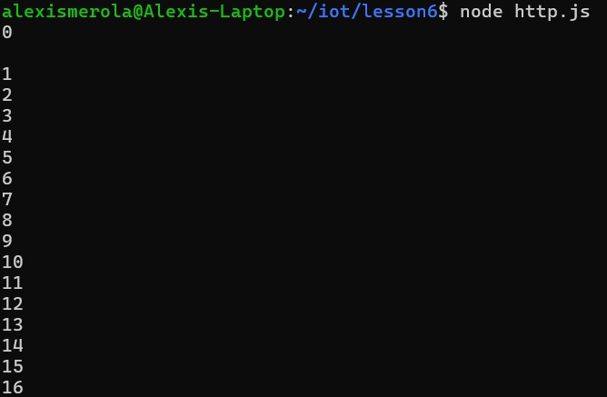
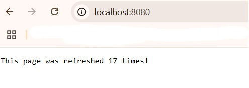
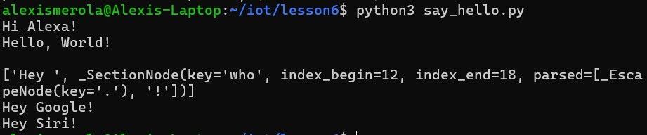

# Lab 6 - Node.js and Pystache
#### 

## Install Node.js and run hello-world.js, hello.js, and http.js
### hello-world.js
#### 

### hello-world.js
#### 

### hello-world.js
#### 

## Install Pystache and run say_hello.py
### say_hello.py
#### 

