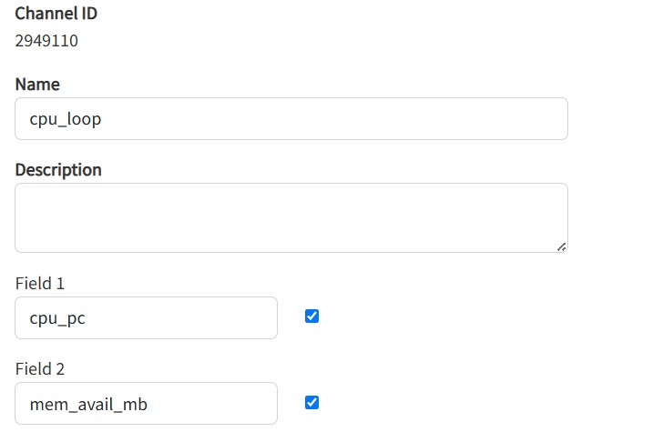
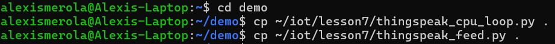
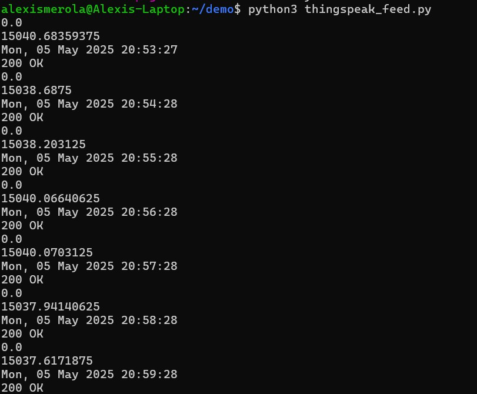
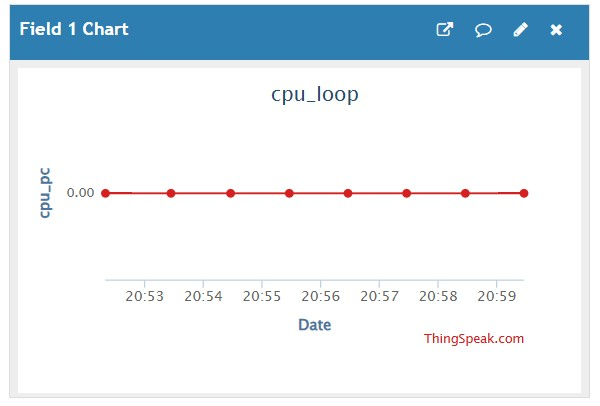
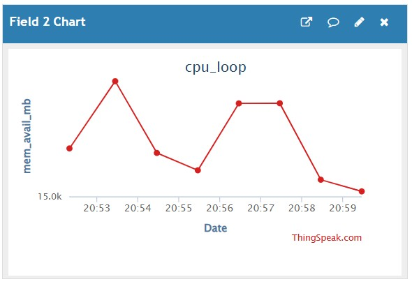

# Lab 7 - ThingSpeak and Google Sheets
#### 

## Lab 7A: ThingSpeak
### Create new channel
#### A new channel was created in ThingSpeak named cpu_loop with two fields:
#### - Field 1: cpu_pc (for CPU usage %)
#### - Field 2: mem_avail_mb (for available memory in MB)
#### This setup allows ThingSpeak to receive and graph real-time system performance data.

### Copy files to ~/demo
#### The scripts thingspeak_cpu_loop.py and thingspeak_feed.py were copied into the ~/demo working directory to isolate lab work from the original source files and enable key storage.

### thingspeak_feed.py
#### The thingspeak_feed.py script was executed, prompting for the Write API Key copied from ThingSpeak. The key was entered and saved in a local API_KEY.pickle file to avoid re-entry in future runs.

#### Once configured, the script started uploading live CPU and memory data to the ThingSpeak channel.

#### Once data was being published, ThingSpeak displayed the incoming values on two separate graphs — one for CPU usage and one for available memory. The graphs updated in real time based on data sent from the local system.

