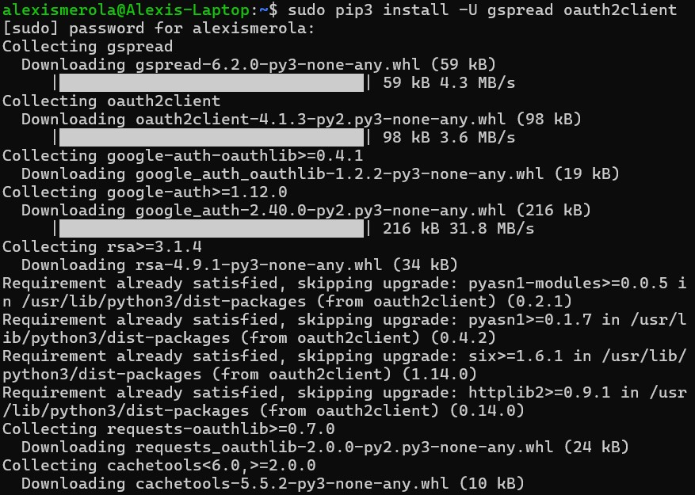
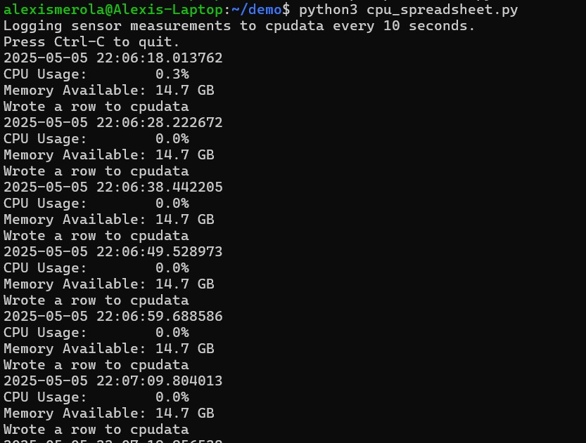
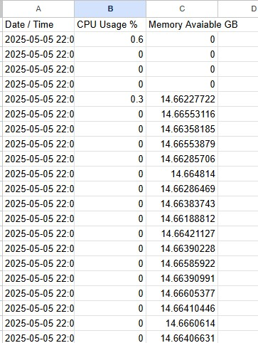

# Lab 7 - ThingSpeak and Google Sheets
#### This lab explored two cloud-based methods for collecting and visualizing system performance data: ThingSpeak and Google Sheets. In Lab 7A, data from a local machine was uploaded to ThingSpeak, where it was displayed on real-time graphs using a dedicated channel. In Lab 7B, a Google Cloud project was configured to allow Python to write data into a shared spreadsheet using the Google Sheets API and a service account. These exercises demonstrated how Internet of Things (IoT) devices and scripts can interact with cloud platforms to track, store, and present live system metrics such as CPU usage and memory availability.

## Lab 7A: ThingSpeak
### Create new channel
#### A new channel was created in ThingSpeak named cpu_loop with two fields:
#### - Field 1: cpu_pc (for CPU usage %)
#### - Field 2: mem_avail_mb (for available memory in MB)
#### This setup allows ThingSpeak to receive and graph real-time system performance data.

### Copy files to ~/demo
#### The scripts thingspeak_cpu_loop.py and thingspeak_feed.py were copied into the ~/demo working directory to isolate lab work from the original source files and enable key storage.

### thingspeak_feed.py
#### The thingspeak_feed.py script was executed, prompting for the Write API Key copied from ThingSpeak. The key was entered and saved in a local API_KEY.pickle file to avoid re-entry in future runs.

#### Once configured, the script started uploading live CPU and memory data to the ThingSpeak channel.

#### Once data was being published, ThingSpeak displayed the incoming values on two separate graphs — one for CPU usage and one for available memory. The graphs updated in real time based on data sent from the local system.

## Lab 7B: Google Sheets
### Set Up Google Cloud Project and Service Account
#### To begin, we created a new project on the Google Cloud Platform named cpudata. In the API console, both the Google Sheets API and Google Drive API were enabled to allow spreadsheet editing access.
#### Next, we created a service account and generated a JSON key file for authentication. This file was downloaded to be used by the Python script for secure access to the spreadsheet.

### Install Required Python Packages
#### In the terminal, the following packages were installed to enable Python-based access to Google Sheets:
#### - sudo pip3 install -U gspread oauth2client
#### These packages allow Python to authenticate with the service account and update a Google Sheet through the Sheets API.

### Copy Required Files
#### The files cpu_spreadsheet.py and the downloaded service account key (cpudata-xxxxxxxxxxxx.json) were moved into the working ~/demo directory:

### Create and Share the Google Spreadsheet
#### - A new Google Sheet named cpudata was created.
#### - The email listed under client_email inside the JSON key file was copied.
#### - This email was shared as an editor on the spreadsheet to allow write access.

### Edit cpu_spreadsheet.py to Match Spreadsheet Name and Key File
#### The Python script was opened in a text editor:
#### - nano cpu_spreadsheet.py
#### Two lines were updated to match the downloaded file and spreadsheet:
#### - GDOCS_OAUTH_JSON = 'rpidata-xxxxxxxxxxxx.json'
#### - GDOCS_SPREADSHEET_NAME = 'cpudata'
#### (Replace xxxxxxxxxxxx with your actual JSON key filename.)

### Format Spreadsheet for Data Logging
#### Row 1 was updated with the following headers:
#### - Column A: Date / Time
#### - Column B: CPU Usage %
#### - Column C: Memory Available GB

### Run the Scipt
#### The final step was to run the script, which successfully recorded live system data into the spreadsheet:
#### - python3 cpu_spreadsheet.py
#### Upon execution, the spreadsheet updated with new rows containing the current timestamp, CPU usage percentage, and available memory.

