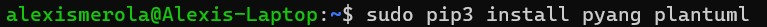
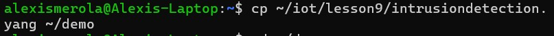
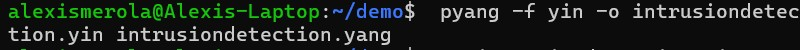
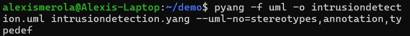
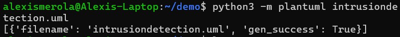
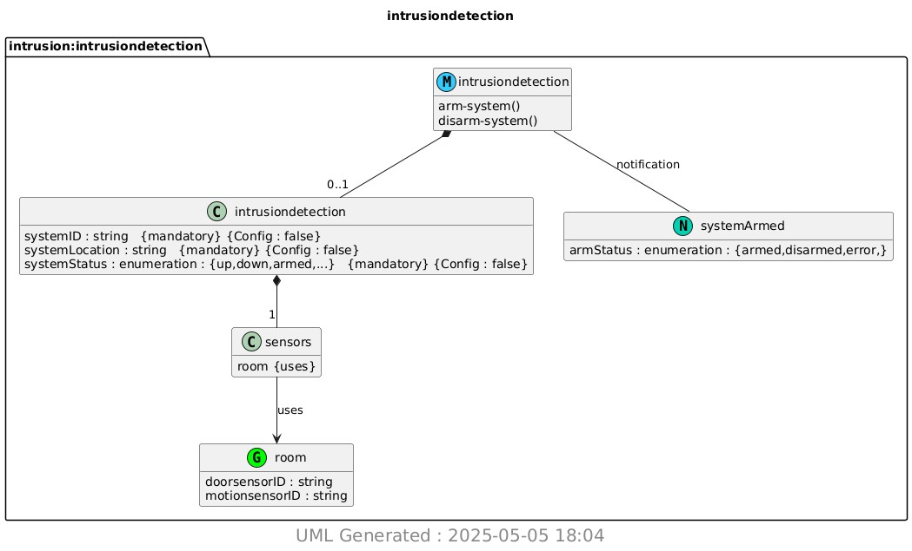

# Lab 9 - YANG
#### 

### Install pyang and PlantUML
#### 

### copy ~/iot/lesson9/intrusiondetection.yang to ~/demo
#### 

### Run pyang to generate intrusiondetection.yin and intrusiondetection.uml
#### 

### Run PlantUML to generate intrusiondetection.png
#### 

