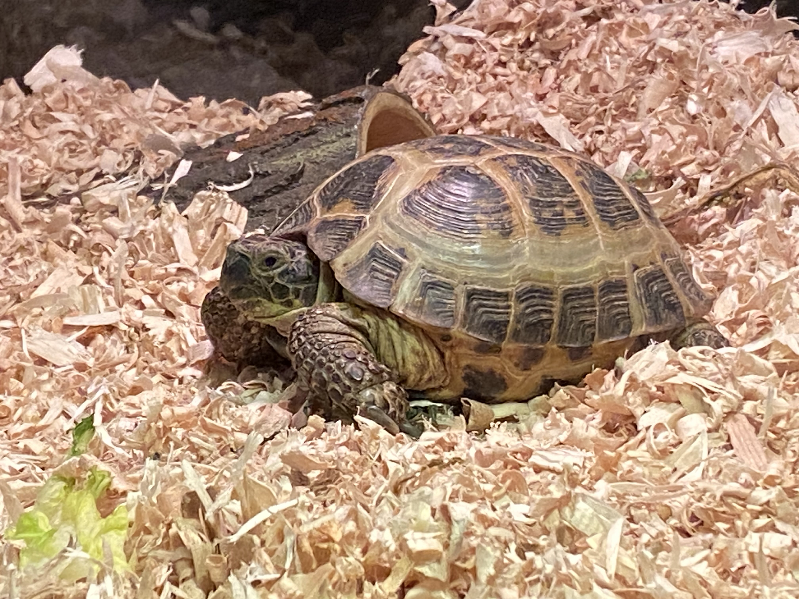
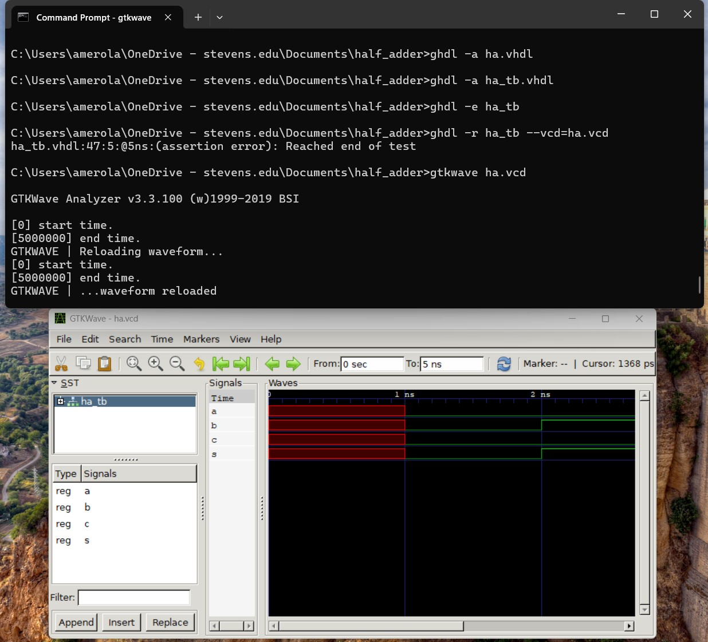

# CPE 322
## Engineering Design VI
### Written By Alexis Merola

**Stevens Insitute of Technology**
*(B.E. in Computer Engineering)*

> Some Sports and Clubs I'm Involved in on Campus Include:

1. Track and Field Team
2. Alpha Phi Omega
3. Tau Beta Pi
4. American Nuclear Society
5. Society of Women Engineers

`In my free time I enjoy:`
- Baking
- Watching movies
- Spending time with my pet tortoise (shown in the image below)

---
[Alexis's GitHub](https://github.com/alexismerola/CPE322.git)

---
## Lab 1 - GHDL and GTKWave
### Half Adder Example

### D Flip-Flop Example

### 4-to-1 Multiplexer Example
